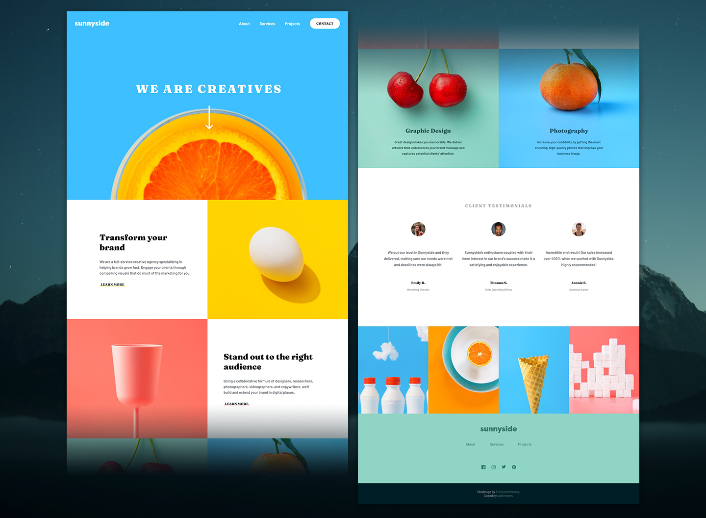
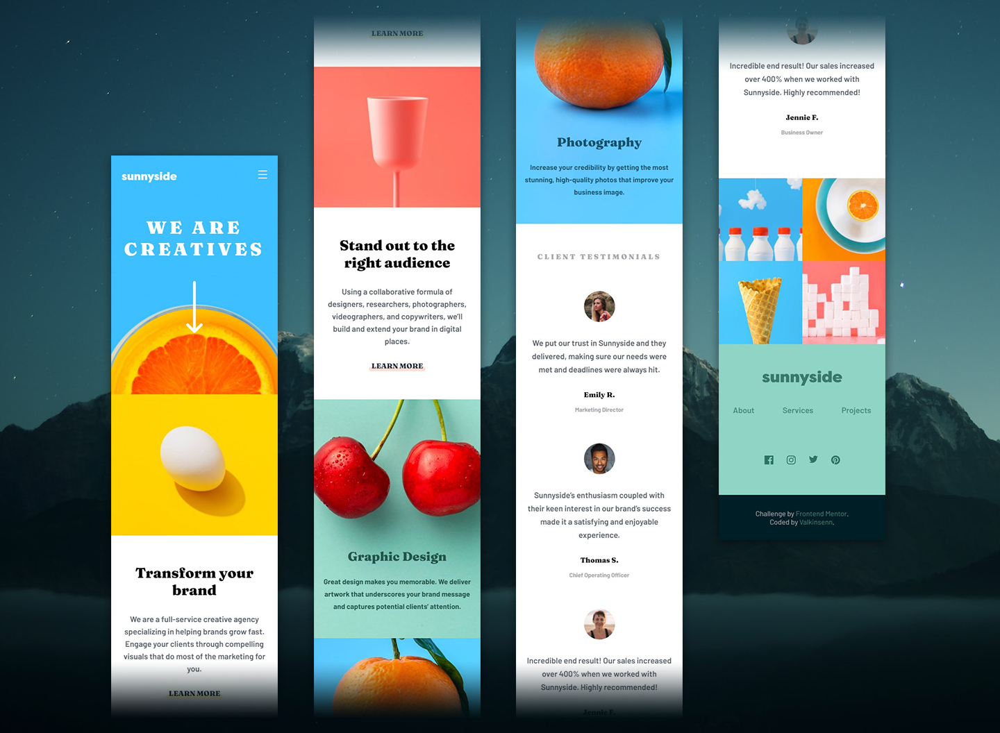

# Frontend Mentor: Sunnyside agency landing page (my solution)

This is my solution to the [Sunnyside agency landing page challenge on Frontend Mentor](https://www.frontendmentor.io/challenges/sunnyside-agency-landing-page-7yVs3B6ef). This one was quite a bit tougher than the last challenge I did on Frontend Mentor, but well worth it for the stuff I learned along the way, like a better understanding of CSS Grid, for instance. I wanted to put a dark theme on this, but doing so (probably) would've disrupted the overall color scheme, so I decided against it.

I might go back and do that in the future anyway, just for kicks.

## Table of contents

- [Overview](#overview)
  - [The challenge](#the-challenge)
  - [Screenshot](#screenshot)
  - [Links](#links)
- [My process](#my-process)
  - [Built with](#built-with)
  - [What I learned](#what-i-learned)
  - [Continued development](#continued-development)
  - [Useful resources](#useful-resources)
- [Author](#author)
- [Acknowledgments](#acknowledgments)

## Overview

### The challenge

Users should be able to:

- View the optimal layout for the site depending on their device's screen size
- See hover states for all interactive elements on the page

### Screenshot

Here's some screenshots of the finished product:

- Desktop screenshot:
  

- Mobile screenshot:
  

### Links

- Live Site URL: [Here's this bad boy in action](http://127.0.0.1:5500/index.html).

## My process

### Built with

- HTML5 (naturally)
- SASS (for easier CSS)
- Custom CSS
- CSS Flexbox
- CSS Grid
- JavaScript (for one tiny little item)

### What I learned

I got a good, hearty refresher on CSS Grid as I went along, along with a refresher on how to make a responsive navbar (mostly) without JavaScript.

And here's how I did it for mobile displays, if anyone's curious:

```html
<nav class="navbar">
  <nav class="nav-box">
    <a class="logo-box" href="#">
      
    </a>

    <!-- Nav Toggler -->
    <label for="menu-btn-checkbox" class="menu-btn">
      <span class="menu-btn-burger"></span>
    </label>
    <!-- IMPORTANT: This needs to go IMMEDIATELY after the label!!! -->
    <input
      type="checkbox"
      name="menu-btn-toggler"
      id="menu-btn-checkbox"
      class="menu-btn-checkbox"
    />

    <nav class="nav-links-box">
      <nav class="links-container">
        <a href="#" class="nav-link">About</a>
        <a href="#" class="nav-link">Services</a>
        <a href="#" class="nav-link">Projects</a>
        <a href="#" class="nav-link">
          <span class="contact">Contact</span>
        </a>
      </nav>
    </nav>
  </nav>
  <div class="navbox-bg"></div>
</nav>
```

```css
/* Makes the navbox hidden and prevents clicks: */
.nav-links-box {
  opacity: 0;
  pointer-events: none;
}

/* Makes the menu appear when clicked and enables clicks: */
.menu-btn-checkbox:checked ~ .nav-links-box {
  opacity: 1;
  pointer-events: auto;
}
```

```js
// DOM Query
const menuBtn = document.querySelector(".menu-btn")

// Sets the default value for the menu button's status:
let menuOpen = false

// Adds a click event listener to the menu button, so that if the menuOpen variable is false, it adds the .open class to the menuBtn element, but if it's true, takes it away:
menuBtn.addEventListener("click", () => {
  if (!menuOpen) {
    menuBtn.classList.add("open")
    menuOpen = true
  } else {
    menuBtn.classList.remove("open")
    menuOpen = false
  }
})
```

### Continued development

As this project has made abundantly clear, I REALLY need to get more comfortable with CSS Grid, along with translating layouts from previews to actual layouts on web pages. I also need to be a tad careful where I put z-indexes, too.

### Useful resources

- [CSS Tricks | A Complete Guide to Grid](https://css-tricks.com/snippets/css/complete-guide-grid/) - An invaluable reference for anyone working with Grid, as it covers everything top to bottom, from to back about working with it.
- [Google](https://www.google.com) - If you don't know something, odds are Google does. Or any search engine, really.

## Author

- Website - I'm working on it, okay? Geez!
- Frontend Mentor - [@valkinsenn](https://www.frontendmentor.io/profile/valkinsenn)
- Twitter - [@yourusername](https://www.twitter.com/yourusername)

## Acknowledgments

This is where you can give a hat tip to anyone who helped you out on this project. Perhaps you worked in a team or got some inspiration from someone else's solution. This is the perfect place to give them some credit.
